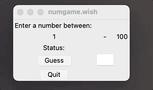

# Learn tcl/tk by programming a simple game

Explore the basic language constructs of Tcl/Tk, which include user input, output, variables, conditional evaluation, simple functions, and basic event driven programming.

My path to this article started with a desire to make advanced use of Expect which is based on Tcl. These efforts results in my previous 2 articles on [Learn Tcl writing a simple game](https://opensource.com/article/23/2/learn-tcl-writing-simple-game) and [Learn Expect writing a simple game](https://opensource.com/article). Along the way, I remembered a long burning desire to create simple GUI apps that I could use to invoke local scripts. I do a bit of ansible automation and over time have collected a number of local scripts. Some of them I use often enough that it becomes annoying to go through the cycle of 1) open terminal, 2) `cd` to the right place, 3) type a long `ansible-playbook` with options to start the desired automation. I use MacOS on a daily basis, and what I really wanted was a menu item or icon I could click on to bring up a simple UI to accept parameters and run the thing I wanted to do.

The classic Tcl books include documentation on the popular Tk extensions. Seeing I was already deep into this topic, I gave it (that is `wish`) a try.

I've never really been a GUI or front-end developer, but I found the Tcl/Tk methods of script writing fairly straight forward. Once again I find myself pleased to revisit such venerable stalwart of UINX history -- something still available and useful on modern platforms.

## Install Tcl/Tk

On a Linux system, I used this:

```
# dnf install tcl
# which wish
/bin/wish
```

On macOS, you can use Homebrew to install the latest Tcl/Tk:

```
$ brew install tcl-tk
$ which wish
/usr/local/bin/wish
```

## Concepts covered

Most of these game-writing articles cover the typical programming language constructs such as loops, conditionals, variables, functions/procedures, etc. 

In this article we dive into event driven programming.  With event driven programming, your executable enters into a special built-in loop which waits for things to happen and triggers code based desired outcomes.  These events can consist of things like keyboard input, mouse movement, button clicks, timing triggers, or nearly anything that your computer hardware can recognize (perhpas even from special-purpose devices).  The code in your program sets the stage for what it should present to the end user, what kinds of inputs to look for, how to behave when these inputs are received, and then enters the event loop waiting for input.

The concept for this article is not far from my other Tcl articles. The big difference here is the replacement of looping constructs with GUI setup and an event loop used to process the user input. The other difference is of course the various aspects of GUI development needed to make a workable user interface. With Tk GUI development we will need to look at 2 fundamental constructs called Widgets and Geometry managers.

Widgets are various UI elements that make up visual elements you see and interact with.  These include buttons, text areas, labels, entry fields, and various flavors of option selections like menus, check boxes, radio buttons, etc.  Widgets also include other visual elements like borders and line separators.

Geometry managers play a cricial role in laying out where your Widgets actually sit in the displayed window. There are a few different kinds of gemoetry managers you can use; we'll mainly use the `grid` geometry to lay Widgets out in neat rows and explain some of the geometry manager differences at the end of this article.

## Guess the number using "wish"

Since this example game code is different from my others, I've broken it up into chunks to facilitate the explination.

Start by creating the basic executable script numgame.wish:

```
$ touch numgame.wish
$ chmod 755 numgame.wish
```

Using your favorite editer enter the code below.

The first section:
```
#!/usr/local/opt/tcl-tk/bin/wish

set LOW 1
set HIGH 100
set STATUS ""
set GUESS ""
set num [expr round(rand()*100)]
```
The first line sets up the script shell to use and then starts to initialize several global variables. I've decided to use all upper-case variables for globals bound to widgets that watch these values.  The `num` global is the variable set to the random value we want the game player to guess; this uses tcl's command execution to derive the value saved to the variable.

```
proc Validate {var} {
	if { [string is integer $var] } {
		return 1
	}
	return 0
}
```
This is a special function we will bind to an entry widget. It's purpose is to validate the data entered in. The command execution looks for integer numbers to accept, and rejects everything else.

```
proc check_guess {guess num} {
	global STATUS LOW HIGH GUESS

	if { $guess < $LOW } {
		set STATUS "What?"
	} elseif { $guess > $HIGH } {
		set STATUS "Huh?"
	} elseif { $guess < $num } {
		set STATUS "Too low!"
		set LOW $guess
	} elseif { $guess > $num } {
		set STATUS "Too high!"
		set HIGH $guess
	} else {
		set LOW $guess
		set HIGH $guess
		set STATUS "That's Right!"
		destroy .guess .entry
		bind all <Return> {.quit invoke}
	}

	set GUESS ""
}
```

This is the meat of our value guessing logic. The `global` statement allows us to modify the global variables above (more on this topic later). The conditional looks for input that is out of bounds of 1-100 and also outside of values you already guessed. Valid guesses are compared against our random value. The LOW and HIGH guesses are tracked in global variables that will be reported in the UI.  At each stage, the global STATUS is updated, and this status messages is automatically reported in the UI.  In the case of a correct guess we have a `destroy` statement that will remove the "Guess" button and the entry widget, and re-bind the Return (or Enter) key to invoke the "Quit" button.

The last statement ```set GUESS  ""``` is used to clear the entry widget for the next guess.

```
label .inst -text "Enter a number between: "
label .low -textvariable LOW
label .dash -text "-"
label .high -textvariable HIGH
label .status -text "Status:"
label .result -textvariable STATUS
button .guess -text "Guess" -command { check_guess $GUESS $num }
entry .entry -width 3 -relief sunken -bd 2 -textvariable GUESS -validate all \
	-validatecommand { Validate %P }
focus .entry
button .quit -text "Quit" -command { exit }
bind all <Return> {.guess invoke}
```
This is the section where the user interface is set up. The first 6 label statements create various bits of text that display on our UI.  The option `-textvariable` watches the given variable and updates the label's value automatically. There you will see bindings to global variables LOW, HIGH, and STATUS -- later in the running example you will see the updating in real time.

The `button` lines set up the "Guess" and "Quit" buttons, with the `-command` option specifying what to do when the button is pressed. The "Guess" button invokes the `check_guess` procedure logic above to check the users entered value.

The `entry` widget gets more interesting. It set up a 3-character wide input field, and binds its input to the GUESS global. It also configures validation with the `-validatecommand` option. We will see that this prevents the entry widget from accepting anything other than numbers.

The `focus` command is UI polish that starts the program with the entry widget active for input. Without this, you need to click into the entry widget first before you can type.

The `bind` command is additional UI polish that automatically clicks the "Guess" button when the Return key is pressed. If you remember from above in `check_guess`, guessing the correct value re-binds Return to the "Quit" button.

```
grid .inst
grid .low .dash .high
grid .status .result
grid .guess .entry
grid .quit
```
This is finally where the GUI layout is defined. The `grid` geometry manager is called in a series of setps to incrementally build up the desired user experience. It essentially sets up 5 rows of widgets. The first 3 are labels displaying various values, the 4th is the "Guess" button and entry widget, then finally the "Quit" button.

At this point, the program is initialized and the `wish` shell enters into the event loop. It will now wait patiently for the user to enter integer values, press buttons, and update labels based on changes it finds in watched global variables. Notice that the input cursor starts in the entry field and pressing Return will invoke the appropriate and available button.

## Play the game!
After saving the file run it from command line:
```
$ ./numgame.wish
```

In this case I can't give a console output, so here's an animated GIF to demonstrate how the game is played.




## Follow up

There are a few other tid-bits to follow up on this program ....

The variables used here need not be globals.  Tcl supports the notion of name spaces, and you can organize your bound widget variables into alternate name spaces. For simple programs like this it's probably not worth it. For much larger projects, you might want to consider this approach.

The `proc check_guess` body contains that `global` line I glossed over. The explination is a bit more complicated and gets into the nitty gritty of how Tcl processes text and simplifies the procedure stack. All variables in Tcl are passed by value, and variables reference within the body would be in a local scope. In this case, we want to modify the global variable, not a local scoped version of such. Tcl has a number of ways for referencing variables and executing code in execution stacks higher in the call chain. In some ways it makes for complexities (and mistakes) for simple reference like this, but the call stack manipulation is very powerful and allows for Tcl to implement new forms of conditional and loop constructs that would be cumbersome in other languages.

You were not likely impressed with my mad-UI skills above. Tcl/Tk has a number of tweaks that can make the spacing, fonts, colors, and other UI aspects much more pleasing. I'm a bit more of form-over-function, especially on small efforts like this. Tweaking UI's to be perfect is a special skill of patience I need more practice with.

You may have also noted that the widgets used were not very fancy or modern. I used the original classic widget set reminiscant of the X windows Motif days.  There are default widget extensions called "themed widgets" which can be used to give your application a more modern and polised look and feel. 

Finally in this article, I glossed over the topic of geometry managers which are used to take widgets and place them in a specific order. Nothing can be displayed to the screen unless it is managed by some kind of geometry manager.  The "grid" manager is fairly simple; it places widgets in a line left to right. Hence, I had 5 grid definations to create the 5 row application. Two other geometry managers called `place` and `pack` exist.  The `pack` manager arranges widgets around the edges of the window and the `place` manager allows for fixed placement. In addition to these geometry managers, there are special widgets called `canvas`, `text`, and `panedwindow` that can hold and manage other widgets. A full description of all these can be found in the classic Tcl/Tk reference guides and in this online reference over at [Tk commands](https://tcl.tk/man/tcl8.7/TkCmd/index.html) documentation page.

## Conclusion
In conclusion, Tcl and Tk provide a straightforward and effective approach to building graphical user interfaces and event-driven applications. The simple guess the number game demonstrated here is just the tip of the iceberg when it comes to what you can accomplish with these tools. By continuing to learn and explore Tcl and Tk, you can unlock a world of possibilities for building powerful, user-friendly applications. So keep experimenting, keep learning, and see where your newfound Tcl and Tk skills can take you!